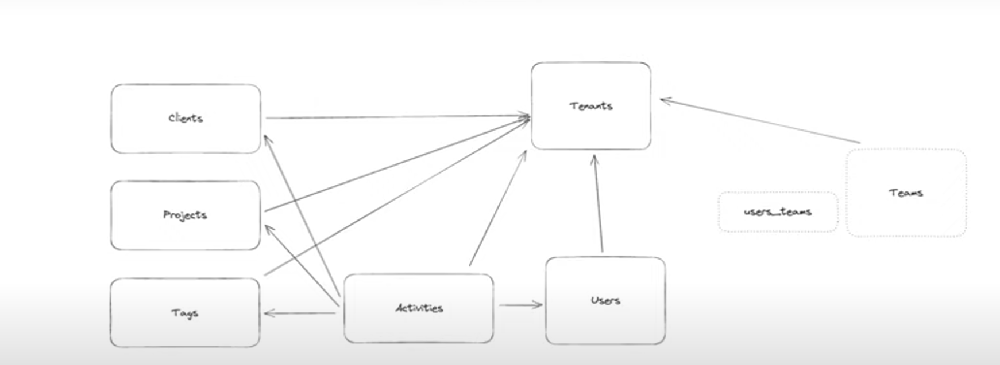

## Features so far..
- [ ] Time tracking by Activity
- [ ] Clients
- [ ] Projects
- [x] Authentication

### Data model so far

## Todo:
Inside the page.tsx, of app directory, I want to show Hello if the user in SignedOut and Hello, {username} if user is signed in.
Now looking at SignedIn content, user doesn't neccessarily has a username when they sign up, as they are signing up using google, so we check first if the user object has a user name if not then we say, Hey what should we call you, update the user object's username on button click and then reload the suer object, so that user sees `Hello, {username}`.
I can't find how to update user, clerkClient.users is undefined, hence updateUser is not working, the `useUser` hook is also giving errors.

## Changed the schema?
`npx prisma generate`
`npx prisma db push` or `npx prims migrate dev --name updated_models`
migrating command: npx prisma migrate dev --name added_username_column

**GET Reuqest can't have body, it'll give an error**.
## Clerk hooks
1. `const { user, isLoaded, isSignedIn } = useUser()`. We can access values like `user.id` , `user.userName`, `user.firstName` etc, we can even update these `user.userName` like things. This hook is a client hook
2. `auth()` This also provides things is `userId` , but if some page/component is declared `use client` at the top, this will not work and give an error as it is a `server only` hook.